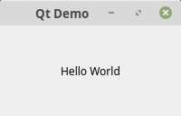
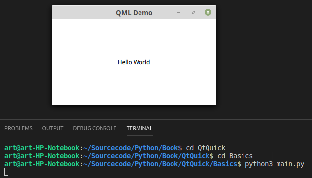
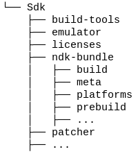
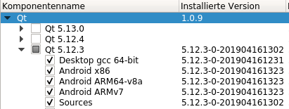
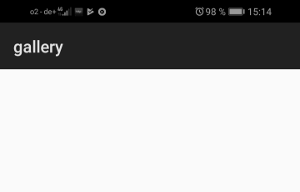

#Part II - Basics

##Many Different Approaches

Because of the fact that Python has been introduced in 1991, meanwhile there are a few approaches to develop Python apps for Android.
There is Tkinter which is a bridge to TK. Tkinter is been delivered with Python. 
There is Kivy which has got a nice approach using a special pythonic language to declare the user interface. 
There is BeeWare which compiles Python to Java-ByteCode. 
There is Enaml Native which act like Pythons answer to React Native and there are a few approaches to bridge to Qt which in pronounced 'Cute'. 
These approaches are PySide, which bridges to Qt4. 
There is PyQt which also bridges to Qt4, PySide2 which bridges to Qt5 and last but not least PyQt5 which we are talking about in this book. 
I am not going to talk about the pros and cons of all these possibilities in this book. Instead I am focusing on solutions. 
To use PyQt5 is a personal decision after working a few years with Qt5. 
Qt5 and PyQt5 are available under an open source license so you might use these frameworks for free as long as you plan to create open source programs. If you are going to create commercial software you have to purchase licenses for both frameworks. 
Even when we using Qt5 we have got two options to develop apps for Android. 
First option is QtWidgets which has been introduced to create platform independent desktops applications and QtQuick which uses a declarative way to implement user interfaces using QML (Qt Markup Language). 
Because at the moment QtQuick lacks of a treeview and a tableview implementation I guess it has been primarily developed to satisfy mobile app development. 
QtQuick has alsk implemented behaviors and transactions which you normally only see on mobile platforms. 
If you have got design background then the QML approach could be your best choice because you don't really have to write code that much and when you like to write imperative code then QtWidgets might be your way. 

##Hello World (QtWidgets)

Now I will show you how a very basic QtWidgets app will look like.   
We will run the app on the desktop first because this is much easier as to deploy to a mobile device.   
All of the first tests you can make on the desktop. Therefore I recommend you to set the window size to something like you will find on your device. We will come to that later.  

*QWidget/Basics/main.py*  
```python
import sys
from PyQt5.QtWidgets import QApplication, QMainWindow, QLabel
from PyQt5.QtCore import Qt


class MainWindow(QMainWindow):
    def __init__(self):
        QMainWindow.__init__(self)
        self.setWindowTitle("Qt Demo")
        label = QLabel("Hello World")
        label.setAlignment(Qt.AlignCenter)
        self.setCentralWidget(label)

if __name__ == "__main__":
    app = QApplication(sys.argv)
    win = MainWindow()
    win.show()
    sys.exit(app.exec())
```

  

The sample is simply self explanatory. We are creating an application object. Instantiate a window. Make the window visible and execute the app main loop.   
In the window there is just a label widget which will be set as the central widget.   
In bigger projects it would be better to create a python file for each class so that the class MainWindow will become an own file called *mainwindow.py*.

##Hello World (QtQuick)

The hello world app for the QtQuick part will be made out of two file. First the main.py where the qml file will be loaded and the main loop will be started and a second file named view.qml where the user interface is been declared.

*Deploy/main.py*
```python
import sys
from PyQt5.QtGui import QGuiApplication
from PyQt5.QtQml import QQmlApplicationEngine


if __name__ == "__main__":
    app = QGuiApplication(sys.argv)
    engine = QQmlApplicationEngine("view.qml")
    if not engine.rootObjects():
        sys.exit(-1)
    sys.exit(app.exec())
```

*Deploy/view.qml*
```qml
import QtQuick 2.0
import QtQuick.Controls 2.5

ApplicationWindow {
    visible: true

    Text {
        anchors.horizontalCenter: parent.horizontalCenter
        anchors.verticalCenter: parent.verticalCenter
        text: "Hello World"
    }
}
```
In order to start the app we have to cd into the Basics directory and start it like this:  

```console
user@machine:/path$ python3 main.py
```

  

This app is similar to the QtWidgets version except the fact that we use a QGuiApplication instead of a QApplication. And also a QQmlApplicationEngine is responsable to load the user interface.

##Deployment

After we have build our first QtQuick app we are going to build an APK (**A**ndroid **P**ac**k**age).
Therefore we first have to install a few other components. 

###pyqtdeploy 2.4

pyqtdeploy is a tool made by the same company who also created pyqt5.   
You can install pyqtdeploy via pip.  

```console
user@machine:/path$ pip3 install pyqtdeploy
```

###Java JDK 8

You should be able to find all you need to install Java JDK 8 here: <a href="https://docs.oracle.com/javase/8/docs/technotes/guides/install/install_overview.html">https://docs.oracle.com/javase/8/docs/technotes/guides/install/install_overview.html</a>

Just to mention I had problem to build the package with Java JDK 10 installed. 

###Android SDK

To install the Android SDK go to <a href="https://developer.android.com/studio">https://developer.android.com/studio</a> scroll down to *Command line tools only* and download the file for your platform.   
Then unzip the file somewhere on your computer. 
After unzipping go to the Sdk/tools/bin directory and run to install all necessary tools:

```console
user@machine:/path$ ./sdkmanager "platform-tools" "platforms;android-28"
```

###Android NDK

To install the Android NDK go to <a href="https://developer.android.com/ndk/downloads">https://developer.android.com/ndk/downloads</a> scroll down to *Older Versions*, click the link *NDK Archives*, agree to the terms and download *Android NDK, Revision 19c* for your platform (Unfortuneatly version 20 is not working for us yet).   
After downloading unzip all the file into the SDK directory as *ndk-bundle*.
Your Android directory should look like the following:   


###QtCreator

Now we also need Qt. You can download it here: <a href="https://www.qt.io/download">https://www.qt.io/download</a>.
You should install the following components.   
   
You need Desktop to test your apps on the desktop.   
You need Android x86 to test yours apps on a simulator.   
You need Android ARM64 to test on a 64 bit device and   
you need Android ARMv7 to test on a 32 bit device.

###Source packages

-openssl-1.0.2s.tar.gz from [https://www.openssl.org/source/](https://www.openssl.org/source/)
-PyQt3D_gpl-5.12.tar.gz from [https://www.riverbankcomputing.com/software/pyqt3d/download](https://www.riverbankcomputing.com/software/pyqt3d/download)
-PyQt5_gpl-5.12.1.tar.gz from [https://www.riverbankcomputing.com/software/pyqt/download5](https://www.riverbankcomputing.com/software/pyqt/download5)
-PyQtChart_gpl-5.12.tar.gz from [https://www.riverbankcomputing.com/software/pyqtchart/download](https://www.riverbankcomputing.com/software/pyqtchart/download)
-PyQtDataVisualization_gpl-5.12.tar.gz from [https://www.riverbankcomputing.com/software/pyqtdatavisualization/download](https://www.riverbankcomputing.com/software/pyqtdatavisualization/download)
-PyQtPurchasing_gpl-5.12.tar.gz from [https://www.riverbankcomputing.com/software/pyqtpurchasing/download](https://www.riverbankcomputing.com/software/pyqtpurchasing/download)
-Python-3.7.2.tar.xz from [https://www.python.org/downloads/source/](https://www.python.org/downloads/source/)
-QScintilla_gpl-2.11.1.tar.gz from [https://www.riverbankcomputing.com/software/qscintilla/download](https://www.riverbankcomputing.com/software/qscintilla/download)
-qt-everywhere-src-5.12.2.tar.xz from [http://download.qt.io/official_releases/qt/5.12/5.12.2/single/qt-everywhere-src-5.12.2.tar.xz.mirrorlist](http://download.qt.io/official_releases/qt/5.12/5.12.2/single/qt-everywhere-src-5.12.2.tar.xz.mirrorlist)
-sip-4.19.15.tar.gz from [https://www.riverbankcomputing.com/software/sip/download](https://www.riverbankcomputing.com/software/sip/download)
-zlib-1.2.11.tar.gz from [https://zlib.net/](https://zlib.net/)


Do not unpack these files!!!   
Just download them and copy them to a specific directory.

###Create the build script

You should change the paths in the following script to your needs.  

*Deploy/build.sh*  
```bash
export ANDROID_NDK_ROOT=/home/art/Android/Sdk/ndk-bundle
export ANDROID_NDK_PLATFORM=android-28
export ANDROID_SDK_ROOT=/home/art/Android/Sdk
python3.7 build.py --target android-32 --installed-qt-dir /home/art/Qt/5.12.3 --no-sysroot --verbose --source-dir ./external-sources
```

###Create the build.py script

The build.py I have got from here: <a href="https://pypi.org/project/pyqtdeploy/#files">https://pypi.org/project/pyqtdeploy/#files</a> from the Demo project.
I have just added these lines of code: 

*Deploy/build.py* 
```python
...
run(['pyqtdeploy-build', '--target', target, '--sysroot', sysroot_dir, '--build-dir', build_dir, 'demo.pdy'])

# copy the main.qml to a directory where androiddeployqt will find it to add required libraries based on the import statements
cp = "cp " + os.path.join(dir_path, "view.qml") + " " + os.path.join(dir_path, build_dir)
run([cp])
# append the ANDROID_PACKAGE to the .pro file
with open(os.path.join(dir_path, build_dir, "main.pro"), "a") as fp:
    fp.write("\ncontains(ANDROID_TARGET_ARCH, armeabi-v7a) {\nANDROID_PACKAGE_SOURCE_DIR = " + os.path.join(dir_path, "android") + "\n}")

os.chdir(build_dir)
...
```

It is necessary that the androiddeployqt app will find a QML file in this directory. It scans all needed QML files for import statements to include the needed shared libraries into the APK.   
androiddeployqt will be called by pyqtdeploy.  

You can find the complete build.py and all other source files in the github repo: [https://github.com/Artanidos/DevAndroidPythonBook](https://github.com/Artanidos/DevAndroidPythonBook)  

With the ANDROID*PACKAGE*SOURCE_DIR we specify that we have got Android specific files like the *AndroidManifest.xml* and the icons in this specific folder.   
Also an app theme is included there. This theme only has one importend thing *Theme.DeviceDefault.Light.NoActionBar*.
This is needed to make the splash screen look not so ugly.   
This is the default splash screen. With this little change the screen is just white.  



###Create the resource file

The resource file will contain our QML file as a python resource.   
To build the resource run the following.  

```console
user@machine:/path$ pyrcc5 main.qrc -o lib/main_rc.py
```

This is needed to find the QML later on the device. 
After these changes we have to change the main.py as follows:  

*Deploy/main.py*  
```python
import sys
import lib.main_rc
from PyQt5.QtGui import QGuiApplication
from PyQt5.QtQml import QQmlApplicationEngine


if __name__ == "__main__":
    app = QGuiApplication(sys.argv)
    engine = QQmlApplicationEngine(":/view.qml")
    if not engine.rootObjects():
        sys.exit(-1)
    sys.exit(app.exec())
```

With ```import lib.main_rc``` we add the resource file.   
And with the double point in **:**/view.qml we will tell Qt to load this file from a resource.

###Create a project file

The project file has the name demo.pdy and is needed for pyqtdeploy to be able to freeze all necessary packages.  

*Deploy/demo.pdy*
```xml
<?xml version='1.0' encoding='utf-8'?>
<Project usingdefaultlocations="1" version="7">
<Python major="3" minor="7" patch="2" platformpython="" />
<Application entrypoint="" isbundle="0" isconsole="0" ispyqt5="1" name="" script="main.py" syspath="">
<Package name="lib">
<PackageContent included="1" isdirectory="0" name="__init__.py" />
<PackageContent included="1" isdirectory="0" name="main_rc.py" />
<Exclude name="*.py" />
<Exclude name="*.qml" />
<Exclude name="*.sh" />
<Exclude name="*.pdy" />
<Exclude name="*.json" />
<Exclude name="*.qrc" />
<Exclude name="build-android-32" />
<Exclude name="sysroot-android-32" />
</Package>
</Application>
<PyQtModule name="QtWidgets" />
<PyQtModule name="QtNetwork" />
<PyQtModule name="QtAndroidExtras" />
<PyQtModule name="QtSvg" />
<PyQtModule name="QtQuick" />
<PyQtModule name="QtQml" />
<PyQtModule name="Qt" />
<PyQtModule name="QtQuickWidgets" />
<PyQtModule name="QtSensors" />
<PyQtModule name="QtBluetooth" />
<StdlibModule name="http.server" />
<StdlibModule name="http" />
<StdlibModule name="ssl" />
<StdlibModule name="sysconfig" />
<StdlibModule name="zlib" />
<StdlibModule name="importlib.resources" />
<StdlibModule name="os" />
<StdlibModule name="marshal" />
<StdlibModule name="imp" />
<StdlibModule name="logging" />
<StdlibModule name="logging.config" />
<StdlibModule name="logging.handlers" />
<StdlibModule name="contextlib" />
<StdlibModule name="urllib" />
<StdlibModule name="urllib.request" />
<StdlibModule name="traceback" />
<ExternalLib defines="" includepath="" libs="-lz" name="zlib" target="android" />
</Project>
```

One importend things here is the fact that we need a lib directory for all other python files to be included into the APK.   
Then all needed Qt packages are defined here. (We don't need all of them).   
And also all needed standard python libraries are listed here.
This file can be produced using this command in the terminal:  

```console
user@machine:/path$ pyqtdeploy
```

###Create sysroot.json

This file hold all properties necessary to create a sysroot directory where some tools will be compiled. 

*Deploy/sysroot.json* 
```json
{
    "Description": "The sysroot for the DynPy application.",

    "android|macos|win#openssl": {
        "android#source":   "openssl-1.0.2s.tar.gz",
        "macos|win#source": "openssl-1.1.0j.tar.gz",
        "win#no_asm":       true
    },

    "linux|macos|win#zlib": {
        "source":               "zlib-1.2.11.tar.gz",
        "static_msvc_runtime":  true
    },

    "qt5": {
        "android-32#qt_dir":        "android_armv7",
        "android-64#qt_dir":        "android_arm64_v8a",

        "linux|macos|win#source":   "qt-everywhere-src-5.12.2.tar.xz",
        "edition":                  "opensource",

        "android|linux#ssl":        "openssl-runtime",
        "ios#ssl":                  "securetransport",
        "macos|win#ssl":            "openssl-linked",

        "configure_options":        [
                "-opengl", "desktop", "-no-dbus", "-qt-pcre"
        ],
        "skip":                     [
                "qtactiveqt", "qtconnectivity", "qtdoc", "qtgamepad",
                "qtlocation", "qtmultimedia", "qtnetworkauth",
                "qtremoteobjects",
                "qtscript", "qtscxml", "qtserialbus",
                "qtserialport", "qtspeech", "qttools",
                "qttranslations", "qtwayland", "qtwebchannel", "qtwebengine",
                "qtwebsockets", "qtwebview", "qtxmlpatterns"
        ],

        "static_msvc_runtime":      true
    },

    "python": {
        "build_host_from_source":   false,
        "build_target_from_source": true,
        "source":                   "Python-3.7.2.tar.xz"
    },

    "sip": {
        "module_name":  "PyQt5.sip",
        "source":       "sip-4.19.15.tar.gz"
    },

    "pyqt5": {
        "android#disabled_features":    [
                "PyQt_Desktop_OpenGL", "PyQt_Printer", "PyQt_PrintDialog",
                "PyQt_PrintPreviewDialog", "PyQt_PrintPreviewWidget"
        ],
        "android#modules":              [
                "QtQuick", "QtCore", "QtGui", "QtNetwork", "QtPrintSupport", "QtWidgets",
                "QtAndroidExtras", "QtQuickWidgets", "QtSvg", "QtBluetooth", "QtNetwork", "QtSensors", 
                "QtQml"
        ],

        "source":                       "PyQt5_*-5.12.1.tar.gz"
    }
}
```

###Build the APK

If all went well we are now able to build the APK and deploy it to a device.
Therefor we run ```./build.sh``` in the terminal. Make sure that *build.sh* is executable.
This first will create a sysroot directory with tools and libraries. If you are going to build the APK a second time you can skip building the sysroot with this option in the *build.sh*: 

```--no-sysroot```

###Install APK to device

When you have succesfully build the APK you are now able to install it to your device.   
First of all make sure the developer-mode is switched on on your device. If not you have to switch it on first.   
Open your device settings app. Look for "About you phone" and search for the "Build Number". Then you have to tap on it seven times.   
You should get a message that the developer options are now turned on. 
Connect your device to your computer using a USB cable.   
Now open the developer option in the settings app and look for USB-Configuration. Normally it is set to "Just load". Chnage it now to media transfer protocol (MTP).   
Then look for USB-Debugging and switch it to on.   
This done you are now able to find your device with the adb command:  

```console
user@machine:/path$ adb devices
List of devices attached
* daemon not running; starting now at tcp:5037
* daemon started successfully
5WH6R19329010194    device
```

If your device is listed copy the string to the left and paste it into the terminal:  

```console
user@machine:/path$ adb -s 5WH6R19329010194 install /home/art/Sourcecode/Python/Book/Deploy/build-android-32/dynpy/build/outputs/apk/debug/demo-debug.apk
```

Also copy the APK path which will be displayed after the build process has finished.

I have put the whole command into the *deploy.sh* file to use it later.

##Summary

Hopefully we have deployed the demo app to our device.
This was the most complicated part of this book.   
To find out how to build and deploy to Android took me several days.   
If you are running into trouble here don't hesitate to contact me.   
Maybe I can help you out and publish our experience into the next version of this book so that other people are not running into trouble. 
