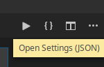

#Teil I - Prolog

##Installation

Wir werden nun anfangen und alle nötigen Programme installieren, um in der Lage zu sein, die gewünschte Software zu schreiben und sie auszuprobieren.  
Um Anwendungen auch auf anderen Platformen installieren zu können, werden wir zusätzliche Software im Kapitel über die Softwarebereitstellung, später in diesem Buch, installieren.  

Ich gehe davon aus, das du bereits Python3 und Pip auf deinem Rechner installiert hast. Wenn nicht, findest du alle notwendigen Informationen auf der [Python](https://python.org) Webseite. Wir benötigen Python in der Version 3.7.   
Ich gehe ausserdem davon aus, dass du in der Lage bist Pakete mittels Pip zu installieren.  

Zuerst werden wir [PyQt5](https://www.riverbankcomputing.com/software/pyqt/intro) welches zusammen mit Qt5 kommt installieren, damit wir Desktop-Applikationen entwickeln können. 

```console
user@machine:/path$ pip3 install PyQt5
user@machine:/path$ pip3 install PyQtWebEngine
```
Dann werden wir [Visual Studio Code](https://code.visualstudio.com/) installieren. VS-Code ist kostenlos und Open Source und hat viele nützliche Erweiterungen um Python Code schreiben zu können.  
Du kannst VS-Code [hier](https://code.visualstudio.com/Download) runterladen. Ich gehe davon aus, dass du in der Lage bist VS-Code selbständig zu installieren, ansonsten findest auf deren Webseite wunderbare Anleitungen.  
Du kannst auch **apt** nutzen, wenn du auf Linux bist.

```console
user@machine:/path$sudo add-apt-repository "deb [arch=amd64] https://packages.microsoft.com/repos/vscode stable main"
user@machine:/path$ sudo apt update
user@machine:/path$ sudo apt install code
```

Im Folgenden werden wir ein paar Erweiterungen installieren, um unsere erste Anwendung zu erstellen.   

##Entwicklungsumgebung Aufsetzen

Nachdem wir nun VS-Code installiert haben, installieren wir noch nachfolgende Erweiterungen wie diese...   

###Python

Python ist eine Erweiterung um Syntax farblich hervorzuheben, Python-Code zu debuggen und enthält einen Linter.  
Manchmal zeigt es sogar die korrekte Intellisense.  


###Coderunner

Mit Coderunner bist du in der Lage, deine Anwendung mit nur einem Klick zu starten.     
  
Du must lediglich den "Play" Knopf drücken.  


###QML

QML ist nützlich um die Syntax für QML-Dateien einzufärben.   


###VS-Code Settings

Du kannst die Settings mit einem Klick auf das Icon mit dem Zahnrad öffnen.     
   
Und dann klickst du **"{}"** auf der oberen rechten Seite des Bildschirms um die Settings als json Datei zu öffnen.     
  
Hier sind ein paar nützliche Einstellungen, welche ich in die *settings.json* eingefügt habe.  

<div class="codehilite"><pre><span></span><code><span class="p">{</span>
    <span class="nt">&quot;workbench.colorTheme&quot;</span><span class="p">:</span> <span class="s2">&quot;Visual Studio Dark&quot;</span><span class="p">,</span>
    <span class="nt">&quot;code-runner.executorMap&quot;</span><span class="p">:</span> <span class="p">{</span>
        <span class="nt">&quot;python&quot;</span><span class="p">:</span> <span class="s2">&quot;python3 $workspaceRoot/main.py&quot;</span><span class="p">,</span>
    <span class="p">},</span>
    <span class="nt">&quot;code-runner.clearPreviousOutput&quot;</span><span class="p">:</span> <span class="kc">true</span><span class="p">,</span>
    <span class="nt">&quot;code-runner.saveAllFilesBeforeRun&quot;</span><span class="p">:</span> <span class="kc">true</span><span class="p">,</span>
    <span class="nt">&quot;git.autofetch&quot;</span><span class="p">:</span> <span class="kc">true</span><span class="p">,</span>
<span class="p">}</span>
</code></pre></div>

##Erste Anwendung

Wir schreiben nun eine simple Anwendung um unsere Umgebung einmal auszuprobieren.    

*basic.py*
```python
import sys
from PyQt5.QtWidgets import QApplication, QWidget


app = QApplication(sys.argv)
w = QWidget()
w.resize(250, 150)
w.setWindowTitle('Simple')
w.show()
app.exec()
```
In diesem Fall, da wir die Python Datei nicht *main.py* genannt haben, führen wir Python in einem Terminal innerhalb von VS-Code aus..  

```console
user@machine:/path$ python3 basic.py
```

  
  
In diesem Beispiel instanziieren wir eine Application, zusätzlich noch ein Widget, setzen den Titel des Fensters, machen das Fenster sichtbar und starten den MainLoop.  
Im MainLoop wird in einer Schleife auf Ereignisse wie Mausklicks, Tastaturanschläge abgefragt und sie dann dem Fenster zur Auswertung übergeben.  In diesem Fall wird das Fenster lediglich auf Veränderung der Fenstergrösse, auf das Verschieben des Fensters und das Schliessen des Fensters reagieren, sollten wir auf den grünen Schliessen-Knopf klicken. Hierbei wird dann die MainLoop verlassen und die Anwendung beendet.   

##Zusammenfassung

Nachdem wir die Entwicklungsumgebung aufgebaut haben, konnten wir die erste Qt Anwendung erstellen und ausführen. 
