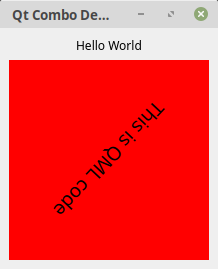

#Teil II - Basis

##Viele Unterschiedliche Ansätze

Da Python schon seit 1991 existiert, wurden bereits mehrere Frameworks für die GUI-Programmierung in Python erstellt.  
Da gibt es Tkinter, welches eine Brücke zu TK ist. Tkinter wird standardmässig mit Python ausgeliefert.  
Dann gibt es noch Kivy, welches eigentlich gute Ansätze, wie zum Beispiel die GUI-Beschreibungssprache kvlang hat, mit der es auf einfache pythonische Weise möglicht ist, das Userinterface zu deklarieren.    
Dann gibt es noch BeeWare mit dem u.a. Python in Java-Byte-Code compiliert wird, um auf Android ausgeführt werden zu können.  
Da gibt es auch noch Enaml Native, welches man als Pythons Antwort zu React Native sehen kann und dann gibt es noch ein Paar Möglichkeiten um eine Brücke zu Qt zu schlagen, als da wären, PySide welches eine Brücke zu Qt4 baut, PyQt welches ebenfalls eine Brücke zu Qt4 ist und PyQt5, was eine Brücke zu Qt5 darstellt und um das es hier in diesem Buch geht.  

Ich werde hier nicht über die Vor- und Nachteile der einzelnen Frameworks schreiben, sondern mich voll auf PyQt5 konzentrieren.  
 
PyQt5 zu benutzen war eine persönliche Entscheidung von mir, da ich bereits ein paar Jahre mit Qt5 und C++ gearbeitet habe.  

Qt5 und PyQt5 sind als Open Source Lizenz verfügbar und man kann beide kostenlos nutzen, solange man damit Open Source Software erstellt.  
Solltest du vorhaben kommerzielle Software zu erstellen, musst du Lizenzen für beide Frameworks erwerben.  

Selbst wenn wir Qt5 nutzen, haben wir zwei Optionen Anwendungen damit zu erstellen.  

Die erste Option ist es eine Anwendung mit QtWidgets zu erstellen, welches den Desktop als Zielplatform hat und QtQuick, welches einen deklarativen Ansatz wählt um Userinterfaces mittels QML(**Q**t **M**arkup **L**anguage) zu beschreiben und eher für mobile Endgeräte konzipiert wurde.  
Da QtQuick derzeit kein Control für einen TreeView und einen TableView besitzt, würde ich nicht empfehlen damit eine Anwendung für den Desktop zu erstellen, ausser man kann auf diese beiden Controls verzichten.  

Mit QtQuick kann man ausserdem Behaviours und Transitions deklarieren, welches man heutzutage eher auf mobilen Endgeräten antrifft.  
 
Wenn du einen Design Hintergrund hast, ist wahrscheinlich der QML-Ansatz interessanter für dich, da du hier nicht wirklich Code erzeugen musst.  
Bist du eher der CoderTyp, dann ist evtl. QtWidgets die richtige Wahl für dich.    

Im folgenden zeige ich dir allerdings gleich drei Varianten Qt Anwendungen zu schreiben.

##Hello World (QtWidgets)

Zuerst erstellen wir eine sehr simple QtWidget Anwendung, mit der wir die Worte *Hello World* auf dem Bildschirm ausgeben. Im Gegensatz zu dem ersten Beispiel benutzen wir hier die Klasse QMainWindow anstelle von QWidget. QMainWindow hat zusätzlich noch die Möglichkeit ein Menu, eine Toolbar und eine Statusbar zu nutzen.     

*QWidget/Basics/main.py*  
```python
import sys
from PyQt5.QtWidgets import QApplication, QMainWindow, QLabel
from PyQt5.QtCore import Qt


class MainWindow(QMainWindow):
    def __init__(self):
        QMainWindow.__init__(self)
        self.setWindowTitle("Qt Demo")
        label = QLabel("Hello World")
        label.setAlignment(Qt.AlignCenter)
        self.setCentralWidget(label)

if __name__ == "__main__":
    app = QApplication(sys.argv)
    win = MainWindow()
    win.show()
    sys.exit(app.exec())
```


Das Beispiel ist fast selbsterklärend. Wir instanziieren das Applikations-Objekt indem wir ihm die Argumentenliste der Anwendung übergeben, erzeugen eine Instanz von MainWindow, unserer Fensterklasse. Machen das Fenster mit Aufruf der Methode *show()* auf dem Bildschirm sichtbar und rufen die Hauptschleife der Applikation auf.  
In der Init-Methode des Fensters rufen wir zuerst einmal die Init-Methode der VaterKlasse auf, setzen den Titel des Fensters und erzeugen eine Instanz eines Labels, welches hier als zentrales Widget gesetzt wird.  
QMainWindow hat neben dem Menu, der Menubar und der Statusbar das zentrale Widget, welches den inneren Bereich des Fensters ausfüllt.  
In grösseren Projekte wäre es sinnvoller jede Klasse in einer eigenen Python-Datei zu speichern. Das macht das Projekt übersichtlicher. Unser Fenster würden wir dann in der Datei *mainwindow.py* speichern.

##Hello World (QtQuick)

Die Hello World Anwendung für QtQuick besteht aus zwei Dateien. Zuerst haben wir da wieder die *main.py* in der wir die Applikation instanziieren und den MainLoop starten und dann haben wir eine zweite Datei mit dem Namen *view.qml* in der wir das Userinterface definieren werden.   

*QtQuick/Basics/main.py*
```python
import sys
from PyQt5.QtGui import QGuiApplication
from PyQt5.QtQml import QQmlApplicationEngine


if __name__ == "__main__":
    app = QGuiApplication(sys.argv)
    engine = QQmlApplicationEngine("view.qml")
    if not engine.rootObjects():
        sys.exit(-1)
    sys.exit(app.exec())
```

*QtQuick/Basics/view.qml*
```qml
import QtQuick 2.0
import QtQuick.Controls 2.5

ApplicationWindow {
    visible: true

    Text {
        anchors.horizontalCenter: parent.horizontalCenter
        anchors.verticalCenter: parent.verticalCenter
        text: "Hello World"
    }
}
```
Um die Anwendung zu starten müssen wir in das Verzeichnis QtQuick/Basics wechseln und die Anwendung wie folgt starten:  

```console
user@machine:/path$ python3 main.py
```

  

Diese Anwendung ist ähnlich der QtWidget-Variante bis auf die Tatsache, das wir QGuiApplication anstelle von QApplication benutzen. Und ausserdem nutzen wir QQmlApplicationEngine, um die QML-Datei zu laden.  Des Weiteren deklarieren wir wie bereits gesagt das Userinterface mit Hilfe von QML. Auf QML werde ich in diesem Buch nicht näher eingehen, da es hierfür bereits ausreichend Literatur gibt und es den Rahmen diese Buches sprengen würde.  

##QWidget und QML Kombinieren
Eine dritte Möglichkeit, Qt Anwendungen zu schreiben ist die Kombination aus QtWidget und QML in dem man ein QQuickView verwendet, um QML innerhalb einer QtWidget Anwendung zu benutzen.  

*Combo/main.py*
```python
import sys
from PyQt5.QtWidgets import QApplication, QMainWindow, QLabel, QVBoxLayout, QWidget
from PyQt5.QtCore import Qt, QUrl
from PyQt5.QtQuick import QQuickView


class MainWindow(QMainWindow):
    def __init__(self):
        QMainWindow.__init__(self)
        self.setWindowTitle("Qt Combo Demo")
        widget= QWidget()
        layout = QVBoxLayout()
        view = QQuickView()
        container = QWidget.createWindowContainer(view, self)
        container.setMinimumSize(200, 200)
        container.setMaximumSize(200, 200)
        view.setSource(QUrl("view.qml"))
        label = QLabel("Hello World")
        label.setAlignment(Qt.AlignCenter)
        layout.addWidget(label)
        layout.addWidget(container)
        widget.setLayout(layout)
        self.setCentralWidget(widget)
        

if __name__ == "__main__":
    app = QApplication(sys.argv)
    win = MainWindow()
    win.show()
    sys.exit(app.exec())
```

*Combo/view.qml*  
```qml
import QtQuick 2.1

Rectangle {
    id: rectangle
    color: "red"
    width: 200
    height: 200

    Text {
        id: text
        text: "This is QML code"
        font.pointSize: 14
        anchors.centerIn: parent
        PropertyAnimation {
            id: animation
            target: text
            property: "rotation"
            from: 0; to: 360; duration: 5000
            loops: Animation.Infinite
        }
    }
    MouseArea {
        anchors.fill: parent
        onClicked: animation.paused ? animation.resume() : animation.pause()
    }
    Component.onCompleted: animation.start()
}
```
  

Wie bereits gesagt, gehe ich auf die Entwicklung von QML-Anwendungen in diesem Buch nicht näher ein.  
Die Verwendung von QVBoxLayout wird etwas später in diesem Buch erläutert. In diesem Beispiel wird es benutzt, um ein Label und den Container vertikal anzuordnen.  
Sei gewarnt nicht mehrere QQuickViews innerhalb eine Anwendung zu verwenden um Performance-Einbrüche zu vermeiden.  

##Zusammenfassung
Wir haben drei Möglichkeiten gesehen, um Anwendungen mit Qt5 zu erstellen.  
Der QWidgets-Ansatz wird meist bei Desktop-Anwendungen genutzt. Der QML-Ansatz wird meist genutzt, um Anwendungen für mobile Geräte zu erstellen. Und die Kombination kann genutzt werden um QML innerhalb von Desktop-Anwendungen darzustellen.