# Teil III - QtWidgets
## Widgets und Layouts

Jetzt verwenden wir die am häufigsten genutzten Widgets in einer kleinen Desktop-Anwendung, um dir einen ersten Überblick über Widgets und Layouts zu geben.  
Für mehr Details zu jedem Widget lade ich dich ein, im Internet zu suchen. Ein guter Startpunkit hierfür ist die folgende Webseite: [https://doc.qt.io/qt-5/classes.html](https://doc.qt.io/qt-5/classes.html)  
Auf dieser Webweite findest du allerdings nur Beispiele, die in C++ geschrieben sind, aber du wirst sie dir mit meiner Hilfe hier leicht nach Python übersetzen können.  
Hier ist ein Beispiel:  
```cpp
QPushButton *button = new QPushButton("&Download", this);
```  
Da C++ streng typisiert ist wird hier die Variable button als Zeiger mit dem Typ QPushButton deklariert.  
Der Stern "*" weist darauf hin, das button ein Zeiger ist. Das Schlüsselwort "new" kreiert eine Instanz des QPushButton and "this" ist ein Zeiger auf das aufrufende Fenster.  
Nach Python übersetzt sieht es dann so aus:   
```python
button = QPushButton("&Download", self)
```
Wenn du ein Beispiel wie dieses findest,...:
```cpp
findDialog->show();
```
..., dann zeigt es hier wahrscheinlich einen Zeiger auf eine Instanz eines SuchDialoges, dessen Methode show() aufgerufen wird.
Wir übersetzen da zu:
```python
findDialog.show()
```
Manchmal deklariert man Variablen in C++ ohne den "*" vor der Variable und ohne das Schlüsselwort "new". Ausserdem ändert sich der Operator zum Aufrufen von Methoden von "->" zu ".".
```cpp
QFileDialog dialog(this);
dialog.setFileMode(QFileDialog::AnyFile);
```
Das bedeutet, das die Variable dialog mit dem Typ QFileDialog deklariert wurde und mit "this" initialisiert wurde. 
In Python deklarieren wir das wie folgt:
```python
dialog = QFileDialog(self)
dialog.setFileMode(QFileDialog.AnyFile)
```
In Python machen wir keinen Unterschied zwischen Objekten und Zeigern. Beachte ausserdem, das wir in Python anstelle des "::" enum Operators einen "." benutzen, um auf ein Feld zu zugreifen.  

Aber nun ist es Zeit für ein Beispiel.  

*QWidget/BaseWidgets/main.py*
```python
import sys
from PyQt5.QtWidgets import (QApplication, QMainWindow, QLabel, QWidget, QGridLayout, 
                             QLineEdit, QVBoxLayout, QHBoxLayout, QPushButton, QGroupBox, 
                             QRadioButton, QCheckBox, QComboBox)
from PyQt5.QtCore import Qt


class MainWindow(QMainWindow):
    def __init__(self):
        QMainWindow.__init__(self)
        self.setWindowTitle("Qt Demo")
        widget = QWidget()
        layout = QGridLayout()
        hbox = QHBoxLayout()
        vbox = QVBoxLayout()
        self.name_edit = QLineEdit()
        self.name_edit.setPlaceholderText("Enter your full name here")
        self.name_edit.setMinimumWidth(200)
        self.email_edit = QLineEdit()
        self.email_edit.setPlaceholderText("Enter a valid email address here")
        group = QGroupBox("Select category")
        group.setLayout(vbox)
        self.free = QRadioButton("Free")
        self.premium = QRadioButton("Premium")
        self.enterprise = QRadioButton("Enterprise")
        vbox.addWidget(self.free)
        vbox.addWidget(self.premium)
        vbox.addWidget(self.enterprise)
        self.cb = QCheckBox("Send me an invoice")
        self.combo = QComboBox()
        self.combo.addItem("5 GB")
        self.combo.addItem("10 GB")
        self.combo.addItem("20 GB")
        self.combo.addItem("50 GB")
        self.combo.addItem("100 GB")
        ok_button = QPushButton("Ok")
        cancel_button = QPushButton("Cancel")
        hbox.addStretch()
        hbox.addWidget(ok_button)
        hbox.addWidget(cancel_button)
        layout.addWidget(QLabel("Name:"), 0, 0)
        layout.addWidget(self.name_edit, 0, 1)
        layout.addWidget(QLabel("Email:"), 1, 0)
        layout.addWidget(self.email_edit, 1, 1)
        layout.addWidget(QLabel("Data volume"), 2, 0)
        layout.addWidget(self.combo, 2, 1)
        layout.addWidget(self.cb, 3, 0, 1, 2)
        layout.addWidget(group, 4, 0, 1, 2)
        layout.addLayout(hbox, 5, 0, 1, 2)
        widget.setLayout(layout)
        self.setCentralWidget(widget)

        ok_button.clicked.connect(self.okClicked)

    def okClicked(self):
        name = self.name_edit.text()
        email = self.email_edit.text()
        data_volume = self.combo.currentText()
        send_invoice = self.cb.checkState() == Qt.Checked
        if self.free.isChecked():
            category = "Free"
        elif self.premium.isChecked():
            category = "Premium"
        elif self.enterprise.isChecked():
            category = "Enterprise"
        else:
            category = "None"

        print("name:", name)
        print("email:", email)
        print("data:", data_volume)
        print("invoice:", send_invoice)
        print("category:", category)

if __name__ == "__main__":
    app = QApplication(sys.argv)
    win = MainWindow()
    win.show()
    sys.exit(app.exec())
```
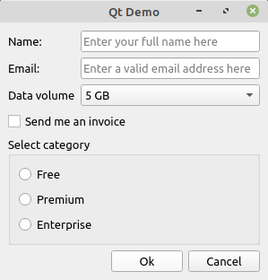

###Layout
In diesem Beispiel haben wir ein Fenster und innerhalb dieses Fensters haben wir ein simples Widget, welches als zentrales Widget gesetzt wird und lediglich dafür da ist, ein Layout (QGridView) zu beherbergen.  
Ein QGridView arrangiert all seine Widgets in Zeilen und Spalten.  
Die Spaltenanzahl ergibt sich aus der Nutzung des Grids.  
Wenn du zum Beispiel ein Widget wie folgt zum Grid hinzufügst ```layout.addWidget(widget, 0, 1)
``` dann wird das Widget in der ersten Zeile (0) in der zweiten (1) Spalte hinzugefügt. Das ergibt eine Spaltenanzahl von 2.  
Wenn du ausserdem eine Zeilen- und Spaltenspanne wie hier nutzt ```layout.addWidget(widget, 0, 1, 1, 4)  
``` dann ergibt sich daraus eine Spaltenanzahl von 5, da das Widget 4 Spalten umspannt.  

Innerhalb des Grid nutzen wir zwei weitere Layouts. Das QVBoxLayout arrangiert die Widgets in vertikaler Richtung und das QHBoyLayout arrangiert die Widgets in horizontaler Richtung. Im Falle der ```hbox
``` nutzen wir ein stretch Objekt (.addStretch) um die Buttons auf der rechten Seite auszurichten. Dieses stretch Objekt ist ein unsichtbares Widget, welches den gesamt verfügbaren Platz einnimmt. Wenn wir von einer Spalte ausgehen, die 500 Pixel breit ist und dort zwei Buttons mit jeweils einer Breite von 100 Pixeln enthalten sind, dann wird das stretch Objekt 300 Pixel breit werden.  
Um die Breite des Fensters zu setzen benutzen wir hier einen kleinen Trick:
```
self.name_edit.setMinimumWidth(200)
```
Wir setzen einfach die Mindestbreite eines Widgets in der zweiten Spalte auf 200 Pixel und alle Widgets in der zweiten Spalten verbreitern sich auf 200. 

###Signals und Slots
Mit Signals und Slots wird in Qt ein Publisher-Subscriber-Pattern kreiert. In unserem Fall feuert der QPushButton, wenn er angeklickt wird, ein "clicked" Signal. Wenn wiederum das Fenster dieses Signal mit einem Slot, in diesem Fall mit der Methode okClicked verbunden hat, dann wird diese Methode jedes mal aufgerufen, wenn der Button angekilickt wird.  
Das Signal wird mit folgendem Code verknüpft:  
```python
ok_button.clicked.connect(self.okClicked)
```
Wenn du mal ein C++ Beipiele zu diesem Thema finden solltest, dann sieht dieses etwas komplizierter aus:  
```cpp
connect(m_button, SIGNAL (clicked()), this, SLOT (handleButton()));
```
Und wird wie folgt in Python übersetzt:
```python
m_button.clicked.connect(self.handleButton)
```
Dieses Beispiel ist einer der Gründe, war es mit Python viel schneller geht ein Programm zu schreiben als mit C++.
## ListView
Einige Widgets wie der QListView arbeiten mit einem Datenmodell. Hier ist ein Beispiel.

*QWidget/ListView/main.py*
```python
import sys
from PyQt5.QtWidgets import QApplication, QMainWindow, QListView
from PyQt5.QtCore import Qt
from PyQt5.QtGui import QStandardItem, QStandardItemModel


class MainWindow(QMainWindow):
    def __init__(self):
        QMainWindow.__init__(self)
        self.setWindowTitle("Qt Demo")
        list = QListView()
        self.model = QStandardItemModel(list)
        cars = [
            'Jaguar',
            'Porsche',
            'Mercedes',
            'Jeep',
            'Toyota'
        ]
 
        for car in cars:
            item = QStandardItem(car)
            item.setCheckable(True)
            self.model.appendRow(item)
 
        list.setModel(self.model)
        self.setCentralWidget(list)

        self.model.itemChanged.connect(self.onItemChanged)

    def onItemChanged(self, item):
        if not item.checkState():
            print(item.text() + " has been unchecked")
        else:
            print(item.text() + " has been checked")
        

if __name__ == "__main__":
    app = QApplication(sys.argv)
    win = MainWindow()
    win.show()
    sys.exit(app.exec_())
```
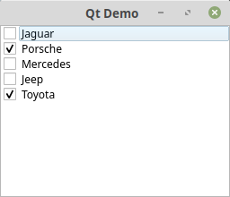

In diesem Beispiel nutzen wir das QStandardItemModel mit QStandardItem's für jeden Listeneintrag. Ganz einfach oder!  
Im nächsten Abschnitt werden wir ein eigenes Datenmodell verwenden.  
## TreeView
In diesem TreeView Beipiel nutzen wir ein eigenes Datenmodell welches von QAbstractItemModel erbt.

*QWidget/TreeView/treemodel.py*
```python
from PyQt5.QtCore import QAbstractItemModel, Qt, QModelIndex


class TreeModel(QAbstractItemModel):
    def __init__(self, in_nodes):
        QAbstractItemModel.__init__(self)
        self._root = TreeNode(None)
        for node in in_nodes:
            self._root.addChild(node)

    def rowCount(self, in_index):
        if in_index.isValid():
            return in_index.internalPointer().childCount()
        return self._root.childCount()
      
    def addChild(self, in_node, in_parent):
        if not in_parent or not in_parent.isValid():
            parent = self._root
        else:
            parent = in_parent.internalPointer()
        parent.addChild(in_node)

    def index(self, in_row, in_column, in_parent=None):
        if not in_parent or not in_parent.isValid():
            parent = self._root
        else:
            parent = in_parent.internalPointer()
  
        if not QAbstractItemModel.hasIndex(self, in_row, in_column, in_parent):
            return QtCore.QModelIndex()
  
        child = parent.child(in_row)
        if child:
            return QAbstractItemModel.createIndex(self, in_row, in_column, child)
        else:
            return QModelIndex()

    def parent(self, in_index):  
        if in_index.isValid():  
            p = in_index.internalPointer().parent()  
            if p:  
                return QAbstractItemModel.createIndex(self, p.row(),0,p)  
        return QModelIndex()  
      
    def columnCount(self, in_index):
        if in_index.isValid():
            return in_index.internalPointer().columnCount()
        return self._root.columnCount()
      
    def data(self, in_index, role):
        if not in_index.isValid():
            return None
        node = in_index.internalPointer()
        if role == Qt.DisplayRole:
            return node.data(in_index.column())
        return None
    

class TreeNode(object):
    def __init__(self, in_data):
        self._data = in_data
        if type(in_data) == tuple:
            self._data = list(in_data)
        if type(in_data) is str or not hasattr(in_data, '__getitem__'):
            self._data = [in_data]
      
        self._columncount = len(self._data)
        self._children = []
        self._parent = None
        self._row = 0
    
    def data(self, in_column):
        if in_column >= 0 and in_column < len(self._data):
            return self._data[in_column]

    def columnCount(self):
        return self._columncount

    def childCount(self):
        return len(self._children)

    def child(self, in_row):
        if in_row >= 0 and in_row < self.childCount():
            return self._children[in_row]

    def parent(self):
        return self._parent

    def row(self):
        return self._row

    def addChild(self, in_child):
        in_child._parent = self
        in_child._row = len(self._children)
        self._children.append(in_child)
        self._columncount = max(in_child.columnCount(), self._columncount)
```  

Wenn man von QAbstractItemModel erbt, bzw. es erweitert, dann muss man auf jeden Fall folgende Methoden implementieren:  index(), parent(), rowCount(), columnCount(), and data(). Diese Methoden werden in allen read-only Modellen benutzt. Sie formen die Basis für editierbare Modelle.

*QWidget/TreeView/main.py*
```python
import sys
from PyQt5.QtWidgets import QApplication, QMainWindow, QTreeView
from PyQt5.QtCore import Qt
from treemodel import TreeModel, TreeNode


class MainWindow(QMainWindow):
    def __init__(self):
        QMainWindow.__init__(self)

        items = []
        items.append(TreeNode("Root"))
        items[0].addChild(TreeNode(["Leaf A", "a", "b"]))
        items[0].addChild(TreeNode(["Leaf B", "c", "d"]))
        items[0].child(1).addChild(TreeNode(["Sub Leaf", "e", "f"]))

        self.setWindowTitle("Qt Demo")
        tree = QTreeView()
        tree.setModel(TreeModel(items))
        tree.setHeaderHidden(True)
        tree.setColumnWidth(0, 150)
        self.setCentralWidget(tree)

if __name__ == "__main__":
    app = QApplication(sys.argv)
    win = MainWindow()
    win.show()
    sys.exit(app.exec_())
```

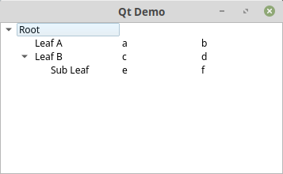  
Dies ist auch ein sehr simples Beispiel aber ein guter Startpunkt um ein Treeview zu nutzen.  
## Dialog
Wenn du es bevorzugst die Fenster und Dialoge mit einem Designtool zu entwerfen, dann kannst du den QtCreator nutzen, welche Bestandteil von Qt ist.
Du kannst Qt und den QtCreator [hier](https://www.qt.io/download) runterladen.  

Starte den QtCreator und erstelle einen Dialog im Design-Mode. 
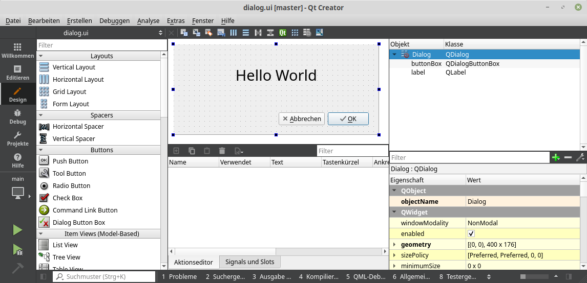  

Speicher den erstellten Dialog wird als *dialog.ui*. Im nachfolgenden Beipiel kannst du sehen, wie man den Dialog mit PyQt5 nutzen kann.  
```python
import sys
from PyQt5.QtWidgets import QApplication
from PyQt5.uic import loadUiType

UIClass, QtBaseClass = loadUiType("dialog.ui")

class MyApp(UIClass, QtBaseClass):
    def __init__(self):
        UIClass.__init__(self)
        QtBaseClass.__init__(self)
        self.setupUi(self)

if __name__ == "__main__":
    app = QApplication(sys.argv)
    window = MyApp()
    window.show()
    sys.exit(app.exec_())   
```
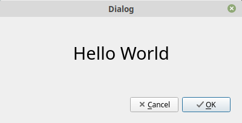
Die Funktion loadUiType lädt den Dialog und liefert das Tupel (UIClass, QtBaseClass) zurück, welche wir nur noch initialisieren müssen.
## MessageDialog
Hier ist ein Beispiel um ein paar Möglichkeiten aufzuzeigen, um eine MessageBox zu nutzen.  

*QWidget/MessageDialog/main.py*
```python
import sys
from PyQt5.QtWidgets import QApplication, QMainWindow, QLabel, QWidget, QVBoxLayout, QPushButton, QMessageBox
from PyQt5.QtCore import Qt


class MainWindow(QMainWindow):
    def __init__(self):
        QMainWindow.__init__(self)
        self.setWindowTitle("Qt Demo")
        widget = QWidget()
        layout = QVBoxLayout()
        simple = QPushButton("Simple")
        save = QPushButton("Save")
        details = QPushButton("Save with details")
        warning = QPushButton("Warning")
        layout.addWidget(simple)
        layout.addWidget(save)
        layout.addWidget(details)
        layout.addWidget(warning)
        widget.setLayout(layout)
        self.setCentralWidget(widget)

        simple.clicked.connect(self.simple)
        save.clicked.connect(self.save)
        details.clicked.connect(self.details)
        warning.clicked.connect(self.warning)

    def simple(self):
        msg = QMessageBox()
        msg.setText("This is a simple message.")
        msg.exec()

    def save(self):
        msg = QMessageBox()
        msg.setText("The document has been modified.")
        msg.setInformativeText("Do you want to save your changes?")
        msg.setStandardButtons(QMessageBox.Save | QMessageBox.Discard | QMessageBox.Cancel)
        msg.setDefaultButton(QMessageBox.Save)
        ret = msg.exec()

    def details(self):
        msg = QMessageBox()
        msg.setText("The document has been modified.")
        msg.setInformativeText("Do you want to save your changes?")
        msg.setStandardButtons(QMessageBox.Save | QMessageBox.Discard | QMessageBox.Cancel)
        msg.setDefaultButton(QMessageBox.Save)
        msg.setDetailedText("1: First line\n2: Seconds line\n3: Third line")
        ret = msg.exec()

    def warning(self):
        ret = QMessageBox.warning(self, "My Application", 
            "The document has been modified.\n Do you want to save your changes?", 
            QMessageBox.Save | QMessageBox.Discard | QMessageBox.Cancel, 
            QMessageBox.Save)

if __name__ == "__main__":
    app = QApplication(sys.argv)
    win = MainWindow()
    win.show()
    sys.exit(app.exec())
```
Behalte bitte in Erinnerung, dass man nicht mehrere MessageBoxen in Folge nutzen sollte.  

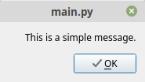  
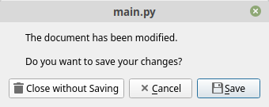  
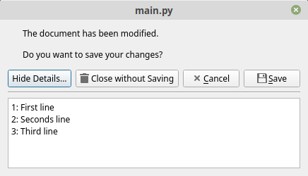  
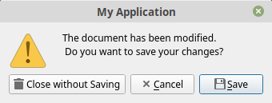  
 
Wie in dem Beispiel mit dem Warning Dialog können wir das Icon auch mit der Methode ```setIcon()
``` ändern.  
Wir haben vier Icons zu auswählen:  
```python
msg.setIcon(QMessageBox.Question)
msg.setIcon(QMessageBox.Information)
msg.setIcon(QMessageBox.Warning)
msg.setIcon(QMessageBox.Critical)
```

##Nutzer Definierte Widgets
Manchmal vermissen wir ein bestimmtes Widget und wenn wir es nirgendwo runterladen können, dann müssen wir es selber entwerfen.  
Im nachfolgenden Beispiel werden wir ein DockWidget, eine ScrollArea 
und natürlich ein eigenes Widget namens Expander kennenlernen.  
Ich erinnere mich daran, den Expander das erste Mal in einer Email-Anwendung unter Windows gesehen zu haben. Leider wurde dieses Widget nicht in Qt integriert.
Die Nutzung des Expanders ist simpel. Klicke einfach in den Expander und der eigentliche Inhalt wird in einer Animation vergrössert und somit angezeigt. Der Inhalt kann eine Liste von Menueinträgen, ein Texteditor, eine Listbox oder was auch immer sein.

*QWidget/UserDefined/main.py*
```python
import sys
from PyQt5.QtWidgets import (QSizePolicy, QListWidget, QListWidgetItem, QApplication, QMainWindow, QLabel, 
			  QTextEdit, QVBoxLayout, QScrollArea, QDockWidget, QWidget)
from PyQt5.QtCore import Qt
from expander import Expander

class MainWindow(QMainWindow):
    def __init__(self):
        QMainWindow.__init__(self)
        self.setWindowTitle("Qt Expander Demo")
        self.resize(640, 480)

        edit = QTextEdit()
        edit.setPlainText("Lorem ipsum dolor...")
        self.content = Expander("Content", "parts.svg")
        self.images = Expander("Images", "images.svg")
        self.settings = Expander("Settings", "settings.svg")
        vbox = QVBoxLayout()
        vbox.addWidget(self.content)
        vbox.addWidget(self.images)
        vbox.addWidget(self.settings)
        vbox.addStretch()
        scroll_content = QWidget()
        scroll_content.setLayout(vbox)
        scroll = QScrollArea()
        scroll.setHorizontalScrollBarPolicy(Qt.ScrollBarAsNeeded)
        scroll.setVerticalScrollBarPolicy(Qt.ScrollBarAsNeeded)
        scroll.setWidget(scroll_content)
        scroll.setWidgetResizable(True)
        scroll.setMaximumWidth(200)
        scroll.setMinimumWidth(200)
        self.navigationdock = QDockWidget("Navigation", self)
        self.navigationdock.setAllowedAreas(Qt.LeftDockWidgetArea | Qt.RightDockWidgetArea)
        self.navigationdock.setWidget(scroll)
        self.navigationdock.setObjectName("Navigation")
        self.addDockWidget(Qt.LeftDockWidgetArea, self.navigationdock)
        self.setCentralWidget(edit)

        # fill content
        self.content_list = QListWidget()
        self.content_list.setSizePolicy(QSizePolicy.Ignored, QSizePolicy.Fixed)
        for i in range(5):
            item = QListWidgetItem()
            item.setText("Item " + str(i))
            self.content_list.addItem(item)
        content_box = QVBoxLayout()
        content_box.addWidget(self.content_list)
        self.content.addLayout(content_box)


        # fill images
        self.images_list = QListWidget()
        self.images_list.setSizePolicy(QSizePolicy.Ignored, QSizePolicy.Fixed)
        for i in range(5):
            item = QListWidgetItem()
            item.setText("Image " + str(i))
            self.images_list.addItem(item)
        images_box = QVBoxLayout()
        images_box.addWidget(self.images_list)
        self.images.addLayout(images_box)


        #fill settings
        self.settings_list = QListWidget()
        self.settings_list.setSizePolicy(QSizePolicy.Ignored, QSizePolicy.Fixed)
        for i in range(5):
            item = QListWidgetItem()
            item.setText("Setting " + str(i))
            self.settings_list.addItem(item)
        settings_box = QVBoxLayout()
        settings_box.addWidget(self.settings_list)
        self.settings.addLayout(settings_box)

        self.content.expanded.connect(self.contentExpanded)
        self.images.expanded.connect(self.imagesExpanded)
        self.settings.expanded.connect(self.settingsExpanded)

    def contentExpanded(self, value):
        if value:
            self.images.setExpanded(False)
            self.settings.setExpanded(False)

    def imagesExpanded(self, value):
        if value:
            self.content.setExpanded(False)
            self.settings.setExpanded(False)

    def settingsExpanded(self, value):
        if value:
            self.content.setExpanded(False)
            self.images.setExpanded(False)


if __name__ == "__main__":
    app = QApplication(sys.argv)
    win = MainWindow()
    win.show()
    sys.exit(app.exec())
```
Das DockWidget kann der Nutzer überall dort hinbewegen, wo es erlaubt ist. In unserem Beispiel ist es eingeschränkt auf den linken und den rechten Rand des Fensters.
```python
self.navigationdock.setAllowedAreas(Qt.LeftDockWidgetArea | Qt.RightDockWidgetArea)
```
Eine ScrollArea kann Widgets aufnehmen, die grösser als der zur Verfügung stehenede Bereich im Fenster ist. Wenn es nicht möglich ist, das komplette Widget anzuzeigen, dann wird jeweils eine Scrollbar angezeigt, mit der der Nutzer in der Lage ist, das ganze Widget zu sichten. In unserem Beispiel werden die Scrollbars nur angezeigt, wenn etwas zu scrollen gibt (Qt.ScrollAsNeeded). Wenn das Widget in die ScrollArea reinpasst, werden keine ScrollBars angezeigt.

*QWidget/UserDefined/expander.py*
```python
import os
from PyQt5.QtWidgets import QWidget, QVBoxLayout, QHBoxLayout, QLabel
from PyQt5.QtCore import (QParallelAnimationGroup, QPropertyAnimation, Qt, pyqtProperty, pyqtSignal, QDir, 
		        QFile, QIODevice)
from PyQt5.QtGui import QImage, QPalette, QPixmap, QColor, QIcon


class Expander(QWidget):
    expanded = pyqtSignal(object)
    clicked = pyqtSignal()

    def __init__(self, header, svg):
        QWidget.__init__(self)
        self.svg = svg
        self.is_expanded = False
        self.text = header
        self.icon = QLabel()
        self.hyper = QLabel()
        self.setColors()
        self.setCursor(Qt.PointingHandCursor)
        self.setAttribute(Qt.WA_Hover, True)
        self.setAutoFillBackground(True)

        vbox = QVBoxLayout()
        hbox = QHBoxLayout()

        hbox.addWidget(self.icon)
        hbox.addSpacing(5)
        hbox.addWidget(self.hyper)
        hbox.addStretch()
        hbox.setContentsMargins(4, 4, 4, 4)
        vbox.addLayout(hbox)
        self.content = QWidget()
        self.content.setStyleSheet("background-color: " + self.palette().base().color().name())
        self.content.setMaximumHeight(0)
        vbox.addWidget(self.content)
        vbox.setContentsMargins(0, 0, 0, 0)
        self.setLayout(vbox)
        self.hyper.linkActivated.connect(self.buttonClicked)

        self.anim = QParallelAnimationGroup()
        self.height_anim = QPropertyAnimation(self.content, "maximumHeight".encode("utf-8"))
        self.color_anim = QPropertyAnimation(self, "color".encode("utf-8"))
        self.height_anim.setDuration(200)
        self.color_anim.setDuration(200)
        self.anim.addAnimation(self.height_anim)
        self.anim.addAnimation(self.color_anim)

    def setColors(self):
        self.label_normal_color = self.palette().link().color().name()
        self.label_hovered_color = self.palette().highlight().color().name()
        self.label_selected_color = self.palette().highlightedText().color().name()
        self.normal_color = self.palette().base().color().name()
        self.selected_color = self.palette().highlight().color()
        self.hovered_color = self.palette().alternateBase().color()

        self.normal_icon = QPixmap(self.createIcon(self.svg, self.normal_color))
        self.hovered_icon = QPixmap(self.createIcon(self.svg, self.label_hovered_color))
        self.selected_icon = QPixmap(self.createIcon(self.svg, self.label_hovered_color))

        self.icon.setPixmap(self.normal_icon)
        self.color = self.normal_color

        self.hyper.setText("<a style=\"color: " + self.label_normal_color + 
	   " text-decoration: none\" href=\"#\">" + self.text + "</a>")

    def createIcon(self, source, hilite_color):
        temp = QDir.tempPath()
        file = QFile(source)
        file.open(QIODevice.ReadOnly | QIODevice.Text)
        data = str(file.readAll(), encoding="utf-8")
        file.close()

        out = os.path.join(temp, hilite_color + ".svg")
        with open(out, "w") as fp:
            fp.write(data.replace("#ff00ff", hilite_color))
        return out

    def setExpanded(self, value):
        if value == self.is_expanded:
            return

        if value:
            self.is_expanded = True
            pal = self.palette()
            pal.setColor(QPalette.Background, self.selected_color)
            self.setPalette(pal)
            self.icon.setPixmap(self.selected_icon)
            self.hyper.setText("<a style=\"color: " + self.label_selected_color + 
	       "; text-decoration: none;\" href=\"#\">" + self.text + "</a>")
        else:
            self.is_expanded = False
            pal = self.palette()
            pal.setColor(QPalette.Background, QColor(self.normal_color))
            self.setPalette(pal)
            self.icon.setPixmap(self.normal_icon)
            self.hyper.setText("<a style=\"color: " + self.label_normal_color + 
	       "; text-decoration: none;\" href=\"#\">" + self.text + "</a>")

        if self.is_expanded:
            self.expandContent()
        else:
            self.collapseContent()
        self.expanded.emit(self.is_expanded)

    def addLayout(self, layout):
        self.content.setLayout(layout)

    @pyqtProperty('QColor')
    def color(self):
        return Qt.black

    @color.setter
    def color(self, color):
        pal = self.palette()
        pal.setColor(QPalette.Background, QColor(color))
        self.setPalette(pal)

    def mouseReleaseEvent(self, me):
        if me.button() != Qt.LeftButton or me.y() > 32:
            return
        self.setExpanded(not self.is_expanded)
        if self.is_expanded:
            self.clicked.emit()

    def expandContent(self):
        if self.content.layout():
            self.height_anim.setEndValue(self.content.layout().sizeHint().height())
        else:
            self.height_anim.setEndValue(0)
        self.height_anim.setStartValue(0)
        self.color_anim.setStartValue(self.normal_color)
        self.color_anim.setEndValue(self.selected_color)
        self.anim.start()

    def collapseContent(self):
        if self.content.layout():
            self.height_anim.setStartValue(self.content.layout().sizeHint().height())
        else:
            self.height_anim.setStartValue(0)
        self.height_anim.setEndValue(0)
        self.color_anim.setStartValue(self.selected_color)
        self.color_anim.setEndValue(self.normal_color)
        self.anim.start()

    def buttonClicked(self):
        self.setExpanded(not self.is_expanded)
        if self.is_expanded:
            self.clicked.emit()

    def enterEvent(self, event):
        if not self.is_expanded:
            pal = self.palette()
            pal.setColor(QPalette.Background, QColor(self.hovered_color))
            self.setPalette(pal)
            self.icon.setPixmap(self.hovered_icon)
            self.hyper.setText("<a style=\"color: " + self.label_hovered_color + 
	       "; text-decoration: none;\" href=\"#\">" + self.text + "</a>")
        QWidget.enterEvent(self, event)

    def leaveEvent(self, event):
        if not self.is_expanded:
            pal = self.palette()
            pal.setColor(QPalette.Background, QColor(self.normal_color))
            self.setPalette(pal)
            self.icon.setPixmap(self.normal_icon)
            self.hyper.setText("<a style=\"color: " + self.label_normal_color + 
	       "; text-decoration: none;\" href=\"#\">" + self.text + "</a>")
        QWidget.leaveEvent(self, event)
```
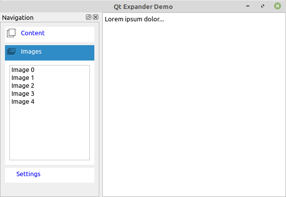
Für den Expander nutzen wir ein paar Tricks.
Zu allererst nutzen wir einen Label als Hyperlink.
```python
self.hyper.setText("<a style=\"color: " + self.label_normal_color + 
    " text-decoration: none\" href=\"#\">" + self.text + "</a>")
```
Wenn wir einen QLabel wie hier benutzen, dann können wir auch auf das Signal linkActivated zugreifen ```linkActivated
``` und ihn mit einem Slot verbinden.
```python
self.hyper.linkActivated.connect(self.buttonClicked)
```
Der nächste Trick ist die Nutzung einer Animation (QParallelAnimationGroup, QPropertyAnimation) mit der wir eine Transition erzeugen können, wenn der Expander erweitert oder verkleinert wird, damit das Ganze recht hübsch aussieht. In unserem Fall animieren wir die ```maximumHeight
``` und die ```color
``` des Widgets.  
Um die Farbe ```color
``` animieren zu können, musste ich ein Property deklarieren.
```python
@pyqtProperty('QColor')
def color(self):
    return Qt.black

@color.setter
def color(self, color):
    pal = self.palette()
    pal.setColor(QPalette.Background, QColor(color))
    self.setPalette(pal)
```
Ein anderer Trick ist die Nutzung einer SVG (**S**calable **V**ector **G**raphic) Grafik für das Icon.
Für diesen Trick öffnen wir die Datei mit dem SVG, ersetzen eine bestimmte Farbe im Text mit der aktuellen Hilite-Farbe (SVG liegt im Textformat vor) und erstellen eine Pixmap auf Basis der SVG-Grafik.  
Ich habe die SVG Grafiken mit InkScape erstellt und eine bestimmte Farbe auf #ff00ff gesetzt, damit sich sie einfach wiederfinden und ersetzen kann.  
Da SVG auf XML basiert kann man den Text einfach ersetzen.
```python
data.replace("#ff00ff", hilite_color)
```

##MarkownEditor
Am Ende die Kapitels werden wir eine etwas komplexere Anwendung erstellen um ein paar noch nicht benutzte Widgets wie das Menu, MenuItem, StatusBar, Action, Splitter, FileDialog, Settings und den WebEngineView in Aktion zu sehen.

```python
import sys
import os
from PyQt5.QtWidgets import (QApplication, QMainWindow, QSplitter, QTextEdit, QAction, 
                             QMessageBox, QFileDialog, QDialog, QStyleFactory)
from PyQt5.QtCore import Qt, QCoreApplication, QSettings, QByteArray, QUrl
from PyQt5.QtGui import QIcon, QKeySequence
from PyQt5.QtWebEngineWidgets import QWebEngineView
import markdown2


class MainWindow(QMainWindow):
    def __init__(self):
        QMainWindow.__init__(self)
        self.cur_file = ""
        self.splitter = QSplitter()
        self.text_edit = QTextEdit("")
        self.preview = QWebEngineView()
        self.preview.setMinimumWidth(300)
        self.setWindowTitle("Markdown [*]")
        self.splitter.addWidget(self.text_edit)
        self.splitter.addWidget(self.preview)
        self.setCentralWidget(self.splitter)
        self.createMenus()
        self.createStatusBar()
        self.readSettings()
        self.text_edit.document().contentsChanged.connect(self.documentWasModified)
        self.text_edit.textChanged.connect(self.textChanged)

    def closeEvent(self, event):
        if self.maybeSave():
            self.writeSettings()
            event.accept()
        else:
            event.ignore()

    def documentWasModified(self):
        self.setWindowModified(self.text_edit.document().isModified())

    def createMenus(self):
        new_icon = QIcon("./assets/new.png")
        open_icon = QIcon("./assets/open.png")
        save_icon = QIcon("./assets/save.png")
        save_as_icon = QIcon("./assets/save_as.png")
        exit_icon = QIcon("./assets/exit.png")

        new_act = QAction(new_icon, "&New", self)
        new_act.setShortcuts(QKeySequence.New)
        new_act.setStatusTip("Create a new file")
        new_act.triggered.connect(self.newFile)
        
        open_act = QAction(open_icon, "&Open", self)
        open_act.setShortcuts(QKeySequence.Open)
        open_act.setStatusTip("Open an existing file")
        open_act.triggered.connect(self.open)
        
        save_act = QAction(save_icon, "&Save", self)
        save_act.setShortcuts(QKeySequence.Save)
        save_act.setStatusTip("Save the document to disk")
        save_act.triggered.connect(self.save)

        save_as_act = QAction(save_as_icon, "Save &As...", self)
        save_as_act.setShortcuts(QKeySequence.SaveAs)
        save_as_act.setStatusTip("Save the document under a new name")
        save_as_act.triggered.connect(self.saveAs)

        exit_act = QAction(exit_icon, "E&xit", self)
        exit_act.setShortcuts(QKeySequence.Quit)
        exit_act.setStatusTip("Exit the application")
        exit_act.triggered.connect(self.close)

        about_act = QAction("&About", self)
        about_act.triggered.connect(self.about)
        about_act.setStatusTip("Show the application's About box")

        file_menu = self.menuBar().addMenu("&File")
        file_menu.addAction(new_act)
        file_menu.addAction(open_act)
        file_menu.addAction(save_act)
        file_menu.addAction(save_as_act)
        file_menu.addSeparator()
        file_menu.addAction(exit_act)

        help_menu = self.menuBar().addMenu("&Help")
        help_menu.addAction(about_act)

        file_tool_bar = self.addToolBar("File")
        file_tool_bar.addAction(new_act)
        file_tool_bar.addAction(open_act)
        file_tool_bar.addAction(save_act)

    def createStatusBar(self):
        self.statusBar().showMessage("Ready")

    def about(self):
        QMessageBox.about(self, "About Markdown",
            "This app demonstrates how to "
               "write modern GUI applications using Qt, with a menu bar, "
               "toolbars, and a status bar.")

    def newFile(self):
        if self.maybeSave():
            self.text_edit.clear()
        self.setCurrentFile("")

    def open(self):
        if self.maybeSave():
            fileName = QFileDialog.getOpenFileName(self)[0]
        if fileName:
            self.loadFile(fileName)

    def save(self):
        if not self.cur_file:
            return self.saveAs()
        else:
            return self.saveFile(self.cur_file)

    def saveAs(self):
        dialog = QFileDialog(self)
        dialog.setWindowModality(Qt.WindowModal)
        dialog.setAcceptMode(QFileDialog.AcceptSave)
        if dialog.exec() != QDialog.Accepted:
            return False
        return self.saveFile(dialog.selectedFiles()[0])

    def maybeSave(self):
        if not self.text_edit.document().isModified():
            return True
        ret = QMessageBox.warning(self, "Qt Demo",
                                "The document has been modified.\n"
                                "Do you want to save your changes?",
                                QMessageBox.Save | QMessageBox.Discard | QMessageBox.Cancel)
        if ret == QMessageBox.Save:
            return self.save()
        elif ret == QMessageBox.Cancel:
            return False
        return True

    def loadFile(self, fileName):
        with open(fileName, mode= "r") as f:
            text = f.read()

        QApplication.setOverrideCursor(Qt.WaitCursor)
        self.setCurrentFile(fileName)
        self.text_edit.setPlainText(text)
        self.text_edit.document().setModified(False)
        self.setWindowModified(False)
        QApplication.restoreOverrideCursor()        
        self.statusBar().showMessage("File loaded", 2000)

    def saveFile(self, fileName):
        QApplication.setOverrideCursor(Qt.WaitCursor)
        with open(fileName, "w") as f:
            f.write(self.text_edit.toPlainText())
        QApplication.restoreOverrideCursor()

        self.setCurrentFile(fileName)
        self.text_edit.document().setModified(False)
        self.setWindowModified(False)
        self.statusBar().showMessage("File saved", 2000)

    def setCurrentFile(self, fileName):
        self.cur_file = fileName
        shown_name = self.cur_file
        if not self.cur_file:
            shown_name = "untitled.txt"
        self.setWindowFilePath(shown_name)

    def writeSettings(self):
        settings = QSettings(QCoreApplication.organizationName(), QCoreApplication.applicationName())
        settings.setValue("geometry", self.saveGeometry())

    def readSettings(self):
        settings = QSettings(QCoreApplication.organizationName(), QCoreApplication.applicationName());
        geometry = settings.value("geometry", QByteArray())
        if not geometry:
            availableGeometry = QApplication.desktop().availableGeometry(self)
            self.resize(availableGeometry.width() / 3, availableGeometry.height() / 2)
            self.move((availableGeometry.width() - self.width()) / 2,
                (availableGeometry.height() - self.height()) / 2)
        else:
            self.restoreGeometry(geometry)

    def textChanged(self):
        path = os.getcwd()
        html = "<html><head><link href=\"assets/pastie.css\" rel=\"stylesheet\" type=\"text/css\"/></head><body>"
        html += markdown2.markdown(self.text_edit.toPlainText(), ..., extras=["fenced-code-blocks"])
        html += "</body></html>"
        self.preview.setHtml(html, baseUrl = QUrl("file://" + path + "/"))


if __name__ == "__main__":
    app = QApplication(sys.argv)
    QCoreApplication.setOrganizationName("Book")
    QCoreApplication.setApplicationName("MarkdownEditor")
    win = MainWindow()
    win.show()
    sys.exit(app.exec_())
```
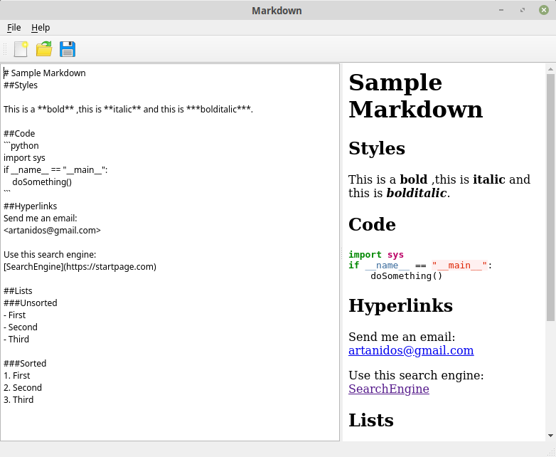  
Der WebEngineView ist ein voll fuktionsfähiger HTML-Browser-Widget und wird hier benutzt, um das aus dem Markdown erzeugte HTML darzustellen.

Das Modul markdown2 wird hier benutzt um markdown in HTML zu verwandeln. Du kannst es wie folgt installieren:
```console
user@machine:/path$ pip install markdown2 
```
Die Methode ```writeSetting
```wird verwendet um die Geometrie des Fensters in einer Datei zu speichern und mit der Methode ```readSettings
``` werden die Werte wieder verwendet um die Grösse und die letzte Position des Fensters wieder zu benutzen.  

Die Methode ```textChanged
``` wird jedes mal aufgerufen, wenn der Nutzer den Text im Editor ändert.
In meinem Programm EbookCreator, das auf diesem Beispiel basiert, musste ich das Verhalten aus Gründen der Performance etwas anpassen. Der Code wird dort in einem Thread ausgeführt.  

Die Aktionen wie new_act, open_act und save_act werden hier doppelt genutzt. Einmal im Menu und das andere Mal in der Toolbar.

Wenn du eine Aktion für ein Menu definierst, dann markierst du den Schnellzugriff mit "&". Zum Beispiel das "S" in der Action "&Save".  
Diese Buchstaben dürfen nur einmal unter einem Menu benutzt werden. Wenn du alse "&Save" und "&Save as" nutzt, dann wird das SaveAs niemals mit einem Schnellzugriff aufgerufen werden können.   

Das Widget QTextEdit kann mit einfachem Text und mit RichText betrieben werden. Hierfür nutzen wir die Methode ```self.text_edit.setPlainText(text)
``` um den Inhalt zu setzen.  

In unserem Beispiel wird die Statusbar benutzt um Nachrichten anzuzeigen
```self.statusBar().showMessage("File loaded", 2000)
``` und um Infos für einige Menuitems ```exit_act.setStatusTip("Exit the application") anzuzeigen.
```

Der Editor aus obigem Beispiel war die Basis für meine Anwendung EbookCreator, mit der ich dieses Buch geschrieben habe. Der EbookCreator ist auch in Python und PyQt5 geschrieben und kann dir als  Inspiration helfen. Der Sourcecode ist [hier](https://github.com/Artanidos/EbookCreator) verfügbar.  

##Zusammenfassung
Wir haben gesehen, wie man alle relevanten Widgets in einer Desktop-Anwendung benutzt. Wir haben gesehen, wie eine komplette Anwendung, geschrieben in Python, aussehen kann. 