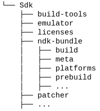
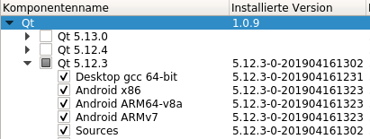
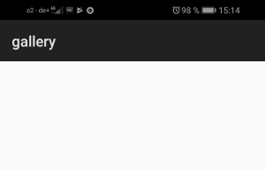

#Teil IV - Installation auf Android

Nun werden wir ein APK (**A**ndroid **P**ac**k**age) erstellen und es auf einem Android Gerät installieren.  
Hierfür müssen wir ein paar zusätzliche Komponenten installieren.  

##Installation von pyqtdeploy 2.4
pyqtdeploy is eine Anwendung die von der selben Firma wie PyQt5 zur Verfügung gestellt wird.
Du kannst pyqtdeploy mit pip installieren.  

```console
user@machine:/path$ pip3 install pyqtdeploy
```

##Installation von Java JDK 8
Du solltest alles, was du zum Installieren von Java JDK 8 brauchst, hier finden: [https://docs.oracle.com/javase/8/docs/technotes/guides/install/install_overview.html](https://docs.oracle.com/javase/8/docs/technotes/guides/install/install_overview.html)

Nur um es zu erwähnen, ich hatte Probleme ein Paket zu bilden, weil ich Java JDK 10 installiert hatte. Ich habe es deinstallieren müssen.

##Installation von Android SDK
Um das Android SDK zu installieren gehe bitte zu [https://developer.android.com/studio](https://developer.android.com/studio) scrolle runter zu *Command line tools only* und lade die spezifische Version für deine Platform runter.  
Dann entpacke diese Datei irgendwo auf deinem Computer.  
Nachdem du alles entpackt hast, wechsle bitte in das Verzeichnis *../Sdk/tools/bin* und starte den sdkmanager um zusätzliche Werkzeuge zu installieren:

```console
user@machine:/path$ ./sdkmanager "platform-tools" "platforms;android-28"
```

##Installation von Android NDK
Um das Android NDK zu installieren, gehe bitte auf diese Seite [https://developer.android.com/ndk/downloads](https://developer.android.com/ndk/downloads) scrolle runter zu *Older Versions*, und klicke den Link *NDK Archives*, akzeptiere die Terms und lade *Android NDK, Revision 19c* für deine Platform runter (Unglücklicherweise funktioniert Version 20 nicht für unsere Zwecke). Nachdem du alles geladen hast, entpacke die Datei bitte in das SDK-Verzeichnis in das Unterverzeichnis *ndk-bundle*.  
Deine Android-Verzeichnisstruktur sollte dann wie folgt aussehen:   


##Installation von Qt
Nun benötigen wir auch Qt selber. Du kannst es hier runterladen: [https://www.qt.io/download](https://www.qt.io/download).
Folgende Komponenten solltest du installieren.   
   
Du benötigst Desktop gcc 64-bit um die App auf deinem Rechner zu testen.  
Du benötigst Android x86 um die App im Simulator testen zu können.  
Du benötigst Android ARM64 um die App auf einem 64 bit Gerät zu testen.  
Du benötigst Android ARMv7 um die App auf einem 32 bit Gerät zu testen.

##Source Pakete runterladen
Nachfolgende Pakete musst du lediglich runterladen aber nicht auspacken.  

- openssl-1.0.2s.tar.gz from [https://www.openssl.org/source/](https://www.openssl.org/source/)  
- PyQt3D_gpl-5.12.tar.gz from [https://www.riverbankcomputing.com/software/pyqt3d/download](https://www.riverbankcomputing.com/software/pyqt3d/download)  
- PyQt5_gpl-5.12.1.tar.gz from [https://www.riverbankcomputing.com/software/pyqt/download5](https://www.riverbankcomputing.com/software/pyqt/download5)  
- PyQtChart_gpl-5.12.tar.gz from [https://www.riverbankcomputing.com/software/pyqtchart/download](https://www.riverbankcomputing.com/software/pyqtchart/download)  
- PyQtDataVisualization_gpl-5.12.tar.gz from [https://www.riverbankcomputing.com/software/pyqtdatavisualization/download](https://www.riverbankcomputing.com/software/pyqtdatavisualization/download)  
- PyQtPurchasing_gpl-5.12.tar.gz from [https://www.riverbankcomputing.com/software/pyqtpurchasing/download](https://www.riverbankcomputing.com/software/pyqtpurchasing/download)  
- Python-3.7.2.tar.xz from [https://www.python.org/downloads/source/](https://www.python.org/downloads/source/)  
- QScintilla_gpl-2.11.1.tar.gz from [https://www.riverbankcomputing.com/software/qscintilla/download](https://www.riverbankcomputing.com/software/qscintilla/download)  
- qt-everywhere-src-5.12.2.tar.xz from [http://download.qt.io/official_releases/qt/5.12/5.12.2/single/qt-everywhere-src-5.12.2.tar.xz.mirrorlist](http://download.qt.io/official_releases/qt/5.12/5.12.2/single/qt-everywhere-src-5.12.2.tar.xz.mirrorlist)  
- sip-4.19.15.tar.gz from [https://www.riverbankcomputing.com/software/sip/download](https://www.riverbankcomputing.com/software/sip/download)  
- zlib-1.2.11.tar.gz from [https://zlib.net/](https://zlib.net/)

##Den Build-Script erstellen
Passe bitte die Pfade für deine Zwecke an.  

*Deploy/build.sh*  
```bash
export ANDROID_NDK_ROOT=/home/art/Android/Sdk/ndk-bundle
export ANDROID_NDK_PLATFORM=android-28
export ANDROID_SDK_ROOT=/home/art/Android/Sdk
python3.7 build.py --target android-32 --installed-qt-dir /home/art/Qt/5.12.3 --no-sysroot --verbose --source-dir ./external-sources
```
external-sources zeigt auf ein Verzeichnis, in dem alle Pakete aus dem vorherigen Schritt gespeichert wurden.  
Installierst du auf einem Android Gerät mit 64 bit, dann ändere bitte das target zu android-64.  
--installed-qt-dir zeigt auf das Verzeichnis in dem Qt installiert wurde. 

##Erstelle den build.py Script
Den build.py habe ich von hier: [https://pypi.org/project/pyqtdeploy/#files](https://pypi.org/project/pyqtdeploy/#files) aus dem Demo-Projekt.
Ich habe dort folgende Zeilen hinzugefügt: 

*Deploy/build.py* 
```python
...
run(['pyqtdeploy-build', '--target', target, '--sysroot', sysroot_dir, '--build-dir', build_dir, 'demo.pdy'])

# copy the main.qml to a directory where androiddeployqt will find it to add required libraries based on the import statements
cp = "cp " + os.path.join(dir_path, "view.qml") + " " + os.path.join(dir_path, build_dir)
run([cp])
# append the ANDROID_PACKAGE to the .pro file
with open(os.path.join(dir_path, build_dir, "main.pro"), "a") as fp:
    fp.write("\ncontains(ANDROID_TARGET_ARCH, armeabi-v7a) {\nANDROID_PACKAGE_SOURCE_DIR = " + os.path.join(dir_path, "android") + "\n}")

os.chdir(build_dir)
...
```
Es ist wichtig, das das Programm androiddeployqt, welches zu Qt gehört und von pyqtdeploy aufgerufen wird, eine QML-Datei in diesem Verzeichnis findet. Das Programm scannt alle nötigen QML-Dateien nach import statements, um nötige shared libraries mit in das APK zu packen.   

Du findest das komplette build.py und alle anderen Source-Dateien in diesem Github Repo: [https://github.com/Artanidos/DevAndroidPythonBook](https://github.com/Artanidos/DevAndroidPythonBook)  

Mit dem ANDROID\_PACKAGE\_SOURCE_DIR deklarieren wir, das wir Android spezifische Dateien wie zum Beispiel *AndroidManifest.xml* und die Icons in einem bestimmten Verzeichnis abgelegt haben.  
Ausserdem haben wir ein Theme dort abgelegt. 
Dieses Theme hat nur einen wichtige Eintrag:
*Theme.DeviceDefault.Light.NoActionBar*.
Hiermit verhindern wir, das der Standard SplashScreen von Qt angezeigt wird, wenn die App gestartet wird.  

Nachfolgend wird der Standard SplashScreen von Qt gezeigt.  
  
Wir ändern diesen Screen in einen schlichten weissen Hintergrund, da wir ansonsten drei verschiedene Screens beim Starten der Anwendung erhalten würden. Einmal den oberen, dann wird kurz ein weisser Screen gezeigt und dann das eigentlich Programm. Wir reduzieren die Anzahl auf lediglich zwei unterschiedliche Screens, damit es beim Starten nicht so flackert.    
##Resource Datei erstellen
Die Resource Datei enthält unsere QML-Datei als Python Resource.  
Um eine Resource Datei zu erstellen muss man folgenden Befehl ausführen.
```console
user@machine:/path$ pyrcc5 main.qrc -o lib/main_rc.py
```
Dieser Schritt ist nötig, damit die QML Datei später auf dem Gerät gefunden wird.
Nach dem wir nun eine Resource-Datei haben, müssen wir die main.py wie folgt anpassen.  

*Deploy/main.py*  
```python
import sys
import lib.main_rc
from PyQt5.QtGui import QGuiApplication
from PyQt5.QtQml import QQmlApplicationEngine


if __name__ == "__main__":
    app = QGuiApplication(sys.argv)
    engine = QQmlApplicationEngine(":/view.qml")
    if not engine.rootObjects():
        sys.exit(-1)
    sys.exit(app.exec())
```

Mit ```import lib.main_rc
``` fügen wir die Resource hinzu.   
Und mit den Doppelpunkt vor **:**/view.qml teilen wir Qt mit, die QML aus der Resource zu laden.

##Eine Projekt-Datei erstellen
Die Projektdatei hat den Namen demo.pdy und wird von pyqtdeploy benutzt, um alle nötigen Python Pakete einzufrieren.

*Deploy/demo.pdy*
```xml
<?xml version='1.0' encoding='utf-8'?>
<Project usingdefaultlocations="1" version="7">
<Python major="3" minor="7" patch="2" platformpython="" />
<Application entrypoint="" isbundle="0" isconsole="0" ispyqt5="1" name="" script="main.py" syspath="">
<Package name="lib">
<PackageContent included="1" isdirectory="0" name="__init__.py" />
<PackageContent included="1" isdirectory="0" name="main_rc.py" />
<Exclude name="*.py" />
<Exclude name="*.qml" />
<Exclude name="*.sh" />
<Exclude name="*.pdy" />
<Exclude name="*.json" />
<Exclude name="*.qrc" />
<Exclude name="build-android-32" />
<Exclude name="sysroot-android-32" />
</Package>
</Application>
<PyQtModule name="QtWidgets" />
<PyQtModule name="QtNetwork" />
<PyQtModule name="QtAndroidExtras" />
<PyQtModule name="QtSvg" />
<PyQtModule name="QtQuick" />
<PyQtModule name="QtQml" />
<PyQtModule name="Qt" />
<PyQtModule name="QtQuickWidgets" />
<PyQtModule name="QtSensors" />
<PyQtModule name="QtBluetooth" />
<StdlibModule name="http.server" />
<StdlibModule name="http" />
<StdlibModule name="ssl" />
<StdlibModule name="sysconfig" />
<StdlibModule name="zlib" />
<StdlibModule name="importlib.resources" />
<StdlibModule name="os" />
<StdlibModule name="marshal" />
<StdlibModule name="imp" />
<StdlibModule name="logging" />
<StdlibModule name="logging.config" />
<StdlibModule name="logging.handlers" />
<StdlibModule name="contextlib" />
<StdlibModule name="urllib" />
<StdlibModule name="urllib.request" />
<StdlibModule name="traceback" />
<ExternalLib defines="" includepath="" libs="-lz" name="zlib" target="android" />
</Project>
```
Eine wichtige Sache hier ist die Tatsache, das wir ein Verzeichnis benötigen, in dem alle Python-Dateien unserer Anwendung zu finden sind. Wir benutzen hier das Verzeichnis *lib*. In diesem Verzeichnis sollte sich auch eine leere Datei mit dem Namen *\__init__.py* befinden.  
Alle benötigten PyQt Module sollten in dieser Projektdatei aufgelistet werden. (Wir benötigen nicht alle, aber evtl. später)     
Ausserdem werden hier alle benötigten Python Pakete gelistet.  
Die Datei kann mit dem Programm pyqtdeploy erstellt werden:  

```console
user@machine:/path$ pyqtdeploy
```

##sysroot.json erstellen
Diese Datei enthält alle Einstellungen um die das sysroot Verzeichnis zu erstellen. Die sysroot enthält ein paar Werkzeuge um das APK zu erstellen. 

*Deploy/sysroot.json* 
```json
{
    "Description": "The sysroot for the DynPy application.",

    "android|macos|win#openssl": {
        "android#source":   "openssl-1.0.2s.tar.gz",
        "macos|win#source": "openssl-1.1.0j.tar.gz",
        "win#no_asm":       true
    },

    "linux|macos|win#zlib": {
        "source":               "zlib-1.2.11.tar.gz",
        "static_msvc_runtime":  true
    },

    "qt5": {
        "android-32#qt_dir":        "android_armv7",
        "android-64#qt_dir":        "android_arm64_v8a",

        "linux|macos|win#source":   "qt-everywhere-src-5.12.2.tar.xz",
        "edition":                  "opensource",

        "android|linux#ssl":        "openssl-runtime",
        "ios#ssl":                  "securetransport",
        "macos|win#ssl":            "openssl-linked",

        "configure_options":        [
                "-opengl", "desktop", "-no-dbus", "-qt-pcre"
        ],
        "skip":                     [
                "qtactiveqt", "qtconnectivity", "qtdoc", "qtgamepad",
                "qtlocation", "qtmultimedia", "qtnetworkauth",
                "qtremoteobjects",
                "qtscript", "qtscxml", "qtserialbus",
                "qtserialport", "qtspeech", "qttools",
                "qttranslations", "qtwayland", "qtwebchannel", "qtwebengine",
                "qtwebsockets", "qtwebview", "qtxmlpatterns"
        ],

        "static_msvc_runtime":      true
    },

    "python": {
        "build_host_from_source":   false,
        "build_target_from_source": true,
        "source":                   "Python-3.7.2.tar.xz"
    },

    "sip": {
        "module_name":  "PyQt5.sip",
        "source":       "sip-4.19.15.tar.gz"
    },

    "pyqt5": {
        "android#disabled_features":    [
                "PyQt_Desktop_OpenGL", "PyQt_Printer", "PyQt_PrintDialog",
                "PyQt_PrintPreviewDialog", "PyQt_PrintPreviewWidget"
        ],
        "android#modules":              [
                "QtQuick", "QtCore", "QtGui", "QtNetwork", "QtPrintSupport", "QtWidgets",
                "QtAndroidExtras", "QtQuickWidgets", "QtSvg", "QtBluetooth", "QtNetwork", "QtSensors", 
                "QtQml"
        ],

        "source":                       "PyQt5_*-5.12.1.tar.gz"
    }
}
```

##APK Erstellen
Wenn alles glatt laufen sollte sind wir nun in der Lage, das APK zu erstellen und es auf dem Gerät zu installieren.
Hierfür lassen wir folgenden Befehl im Terminal laufen: ```./build.sh
```  Stelle sicher, das *build.sh* ausführbar ist.
Zuerst erzeugt dieser Script die sysroot mit den Werkzeugen und Bibliotheken und danach wird das eigentliche APK erstellt. 
Wenn du das APK zum zweiten mal bilden möchtest, kannst du den ersten Schritt überspringen, in dem du in der Datei *build.sh* das Flag --no-sysroot einfügst: 

```
--no-sysroot
```

##Installaliere das APK auf einem Gerät
Wenn du das APK erfolgreich bilden konntest, dann kannst du es auf deinem Android-Gerät installieren.  
Stell zuerst den Entwicklermodus auf deinem Gerät ein.  
Hierfür öffnest du die Einstellungen-App. Dann öffnest du den Menupunkt "Über das Telefon", welches du wohl unter "System" finden wirst, je nach Version von Android.  
Dort tippst du sieben mal auf die "Build-Nummer" und eine Meldung zeigt dir an, das der Entwickler-Modus aktiviert wurde.  
Suche nun den Menupunkt, "Entwickleroptionen" und verbinde das Gerät mit deinem Computer.  
Suche in den Optionen nach "USB-Konfiguration auswählen" und aktiviere Media Transfer Protocol (MTP). Normal steht diese Option auf "Nur Laden".  
Dann aktiviere das "USB-Debugging".  
Dein Gerät kann nun mit dem Befehl adb gefunden werden:  

```console
user@machine:/path$ adb devices
List of devices attached
* daemon not running; starting now at tcp:5037
* daemon started successfully
5WH6R19329010194    device
```
Wenn dein Gerät gelistet wird, dann kopiere bitte den linken Teil mit der Nummer und vervollständige den nachfolgen Befehl:  

```console
user@machine:/path$ adb -s 5WH6R19329010194 install /home/art/Sourcecode/Python/Book/Deploy/build-android-32/dynpy/build/outputs/apk/debug/demo-debug.apk
```
Der Pfad muss natürlich noch angepasst werden, er wird vom build.py ausgegeben. 
Den kompletten Befehl habe ich in die Datei *deploy.sh* kopiert, um ihn wiederzuverwenden.

Nun sollte das Programm in Form eines Icons auf dem Gerät sichtbar sein. 

##Zusammenfassung

Nun haben wir hoffentlich eine Anwendung auf einem Android-Gerät installiert und zum Laufen gebracht.
Wie man eine Anwendung unter Android installiert hat mich mehrere Tage gekostet.  
Solltest Du auch Probleme damit haben, kannst du mich gerne kontaktieren. Eventuell kann ich dir ja helfen und die Erkenntnisse für andere in dieses Buch packen, damit die anderen Leser nicht die selben Fehler bekommen.
