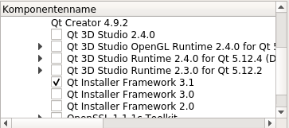
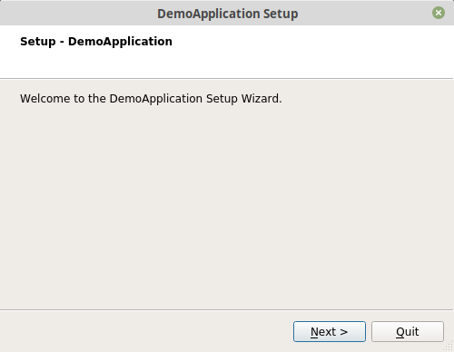

#Teil V - Installation auf Linux
Auf Linux, Windows und MacOS bevorzuge ich ein anderes Werkzeug mit dem Namen **PyInstaller**, um ein Executable zu erstellen, da es Abhängigkeiten automatisch auflöst.  
Um ein SetupProgramm zu erstellen benutze ich das **QtInstallerFramework**, welches mit Qt ausgeliefert wird, da es ebenfalls Cross Platform und kostenlos zu nutzen ist.

##Installation von PyInstaller
Du kannst PyInstaller mit pip installieren.

```console
user@machine:/path$ pip3 install pyinstaller
```
PyInstaller kombiniert eine Python-Anwendung und alle Abhängigkeiten, inlusive Python selber, in ein Paket. Der Endnutzer kann auf diese Weise die Anwendung ausführen, ohne Python und dessen Module installieren zu müssen.

##Installation von QtInstallerFramework
Nun benötigen wir auch noch Qt selber. Du kannst es dir hier herunterladen: [https://www.qt.io/download](https://www.qt.io/download)  
Du solltest die folgenden Komponenten installieren.
  
Wenn dort keine Option für die Version 3.1 (Windows) angezeigt wird, dann tut es auch Version 3.0.

##Paket Bilden
Um ein Paket zu erstellen lasse einfach den pyinstaller mit deinem main.py als Argument laufen.
```console
user@machine:/path$ pyinstaller main.py
```
PyInstaller trägt alle nötigen Module zusammen und packt sie zusammen mit Python in ein Verzeichnis. Man spricht hierbei vom Freezing (Einfrieren). Der Endnutzer führt somit genau das Programm mit den Paketen in der Version aus, welche wir getestet haben.

##Paket Testen
Du kannst die Anwendung wie folgt testen:
```console 
user@machine:/path$ dist/main/main
```
Theoretisch könntest du jetzt die Dateien aus dem Verzeichnis dist/main in eine ZIP-Datei packen und sie ausliefern, ich empfehle aber ein SetupProgramm zu erstellen, welches der Endnutzen einfach nur ausführen muss, um die Anwendung zu installieren. Hierfür nutzen wir das QtInstallerFramework.

##Setup Paket Erstellen
Um ein SetupProgramm zu erstellen, legen wir erst einmal ein Verzeichnis mit dem Namen *config* an.
Innerhalb dieses Verzeichnisses legen wir die Datei *config.xml* mit folgendem Inhalt an.  

*config/config.xml*
```xml
<?xml version="1.0" encoding="UTF-8"?>
  <Installer>
      <Name>DemoApplication</Name>
      <Version>1.0.0</Version>
      <Title>DemoApplication</Title>
      <Publisher>Publisher</Publisher>
      <StartMenuDir></StartMenuDir>
      <TargetDir>@HomeDir@/DemoApplication</TargetDir>
      <Translations>
        <Translation>en.qm</Translation>
    </Translations>
  </Installer>
```
Fülle die nachfolgenden Felder wie folgt:  

| Field | Value |
|  ---     |   ---     |
| Name | Name der Anwendung |
| Version | Version der Anwendung |
| Title | Name der Anwendung |
| Publisher |   Dein Name / Firmenname |
| TargetDir | Installationsverzeichnis |
| Translation | Sprache der Anwendung |

Wenn du keine Sprache angibst, dann nimmt Qt die Sprache deines Betriebssystemes, welches nicht immer gewünscht ist. In meinem Fall habe ich zum Beispiel eine deutsche Linux-Installation und möchte aber eine Anwendung in Englisch erstellen.  

Nun erstellen wir ein Verzeichnis mit dem Namen *packages* und dort drinnen legen wir ein Verzeichnis mit dem Namen *com.vendor.product* an. In diesem Verzeichnis legen wir wiederum eines mit dem Namen *data* an, in die wir später die Binärdateien reinkopieren und ein Verzeichnis mit dem namen *meta*. In dem Verzeichnis meta erstellen wir eine Datei mit dem Namen *package.xml* mit dem folgenden Inhalt:  
```xml
<?xml version="1.0" encoding="UTF-8"?>
  <Package>
      <DisplayName>DemoApplication</DisplayName>
      <Description>Install this application.</Description>
      <Version>0.1.0-1</Version>
      <ReleaseDate>2019-07-15</ReleaseDate>
      <Default>true</Default>
  </Package>
```  
Nun erstellen wir ein Verzeichnis mit dem Namen *bin* im Verzeichnis *data* und kopieren dort alle Dateien aus dem Verzeichnis *dist/main*.  
Neben dem *bin* Verzeichnis können wir später auch noch Verzeichnisse für Plugins, Daten oder ähnlichem anlegen.

```console
user@machine:/path$ mkdir packages/com.vendor.product/data/bin
user@machine:/path$ cp -r dist/main/* packages/com.vendor.product/data/bin
```  
Nun wird es Zeit, das SetupProgramm zu erstellen. Dafür führen wir folgenden Befehl aus:  
```console
user@machine:/path$ binarycreator -f -c config/config.xml -p packages DemoApplication-Linux-1.0.0.Setup
```   
Dieser Befehl erstellt eine Datei mit dem Namen DemoApplication-Linux-1.0.0.Setup, welches an den Endnutzer ausgeliefert werden kann.  
Solltest du keinen Pfad zum binarycreator haben, findest du es unter *Qt/Tools/QtInstallerFramework/3.1/bin*

Du kannst das Setup-Programm starten, in dem du das erzeugte Programm ausführst.


##Zusammenfassung
Am Ende haben wir ein Setup-Programm für eine Python Anwendung erstellt, welches wir einfach an Endnutzer ausliefern können. Alle nötigen Pakete und selbst Python sind dort enthalten.